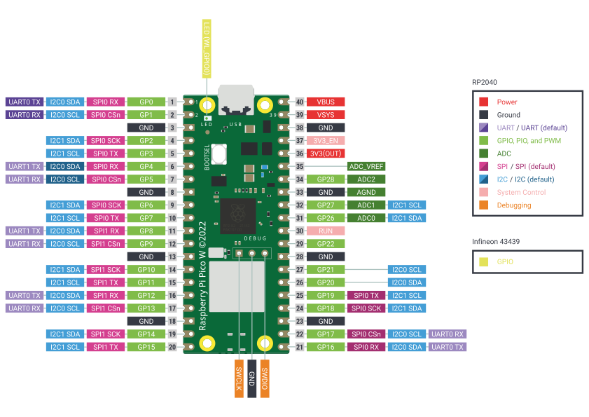

# Zajęcia z MicroPython

## Piny w Raspberry Pi Piko

### Zapal wszystkie diody
[Wszystkie On](wszystkie_on.py)

### Światła drogowe
[Światła drogowe](swiatla_drogowe.py)

### Przycisk
[Przycisk co włączy światła](przycisk.py)

### Gra w refleks
[Gra w refleks](gra_refleks.py)

### Podłączenie brzęczyka
VBus -> Brzęczyk -> Kolektor

Emiter -> GND 

PIN -> 10kOhm -> Baza
